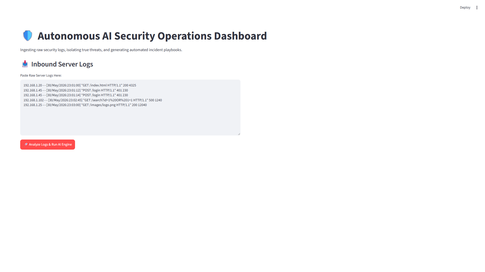
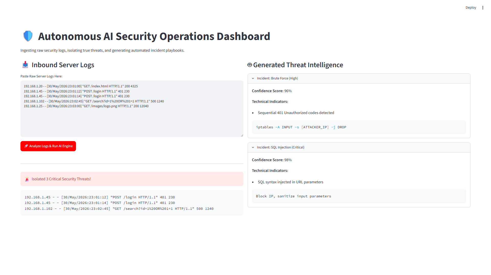

# 🛡️ AI-SOC Threat Pipeline

> **Intelligent Threat Detection & Incident Response**

[](https://github.com/sohansa035-bot/ai-soc-threat-pipeline/releases/tag/v1.0.0)
[](https://github.com/sohansa035-bot/ai-soc-threat-pipeline/actions/workflows/lint.yml)
[](https://github.com/sohansa035-bot/ai-soc-threat-pipeline/actions/workflows/test.yml)
[](https://www.python.org/downloads/)
[]()
[]()
[]()
[](https://opensource.org/licenses/MIT)

> **AI-SOC Threat Pipeline is an intelligent Security Operations Center (SOC) platform that automates log analysis, threat detection, incident correlation, and response recommendations using AI. It helps reduce analyst workload and improves response time by transforming raw security events into actionable insights.**

## 📖 Overview

### The Problem

Security teams receive thousands of alerts every day.

Most alerts are:
- False positives
- Duplicate alerts
- Low priority
- Time-consuming to investigate

Manual analysis slows down incident response and increases Mean Time to Respond (MTTR).

### The Solution

AI-SOC Threat Pipeline combines:
- AI-assisted log analysis
- Threat classification
- Alert correlation
- Automated incident reports
- Response recommendations

to help SOC analysts investigate incidents faster.

### ✨ Key Features

- AI-powered log analysis
- Threat intelligence correlation
- Alert prioritization
- Incident timeline generation
- Risk scoring
- Automated reports
- Dashboard
- REST API

---

## 🏗️ Architecture & Design

Please refer to [docs/design.md](docs/design.md) for detailed architecture diagrams, threat processing workflows, and component responsibilities.

## 💻 Tech Stack

- **Backend & Visualization:** Python, Streamlit
- **AI Integration (Planned for v2.0):** OpenAI
  *Currently using heuristic fast-path logic for v1.0. Future integration will use OpenAI (`gpt-4o-mini`) to analyze unstructured logs for zero-day threat correlation.*
- **Deployment:** Docker

---

## 📸 Screenshots

### Dashboard


### Alert Panel


---

## 📊 Example Output

```json
{
  "severity": "High",
  "attack_type": "Brute Force",
  "confidence": 96,
  "recommended_action": "Block IP",
  "technical_indicators": [
    "Sequential 401 Unauthorized codes detected"
  ]
}
```

---


## 🛠️ Engineering Trade-offs

**Why FastAPI?**
- Currently powers the active REST API with standardized HTTP endpoints.
- Async support handles high-throughput log ingestion with ease.

**Why Streamlit?**
- Rapid prototyping for data applications.
- Minimal frontend overhead for deploying operational dashboards.

**Why Docker?**
- Portable deployments across different environments.
- Ensures reproducibility for the API and Dashboard.

**Why AI Classification?**
- Reduces SOC analyst workload.
- Improves incident prioritization through intelligent scoring.

---

## 📁 Folder Structure

```text
ai-soc-threat-pipeline/
├── api/
│   ├── __init__.py
│   └── main.py
├── classifier/
│   ├── __init__.py
│   └── engine.py
├── parser/
│   ├── __init__.py
│   └── log_parser.py
├── models/
│   ├── __init__.py
│   └── schemas.py
├── dashboard/
│   └── app.py
├── sample_logs/
├── tests/
├── .github/
├── Dockerfile
├── docker-compose.yml
├── requirements.txt
└── README.md
```

---

## 🗺️ Roadmap

- [x] Log Parser
- [x] Threat Classification
- [x] Dashboard
- [x] Docker
- [ ] Multi-Agent Detection
- [ ] SIEM Integration
- [ ] Live Threat Feed
- [ ] SOAR Integration
- [ ] Cloud Deployment

---

## 🤝 Contributing

1. Fork the repository
2. Clone locally
3. Create a feature branch
4. Commit your changes
5. Submit a Pull Request

---

[MIT](LICENSE)

---

*Built to demonstrate AI-assisted SOC workflows, modular Python architecture, and modern software engineering practices.*