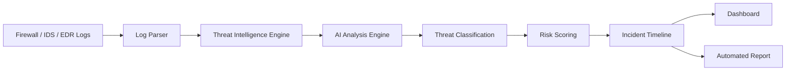

# System Design & Architecture

This document details the architectural design and flow of the AI-SOC Threat Pipeline.

## Architecture Diagram



## Threat Processing Flow

```text
Incoming Logs
      ↓
Normalization
      ↓
Threat Correlation
      ↓
AI Classification
      ↓
Risk Score
      ↓
Incident Report
      ↓
SOC Analyst
```

## Module Responsibilities

1. **Parser Module**: Responsible for high-speed ingestion and filtering of raw text logs. Uses heuristic rules (v1.0) to quickly isolate suspicious patterns like SQL injections or unauthorized accesses, minimizing the volume of logs sent for deep analysis.
2. **Classifier Engine**: Processes isolated anomalies. Evaluates the context of the anomalies to classify the attack type (e.g., Brute Force, SQLi), assigns a severity score, and generates a recommended response action.
3. **API (FastAPI)**: Serves as the orchestration layer. Receives POST requests containing log batches, routes them through the Parser and Classifier, and structures the output into a standardized JSON schema.
4. **Dashboard (Streamlit)**: A lightweight, reactive frontend that visualizes the JSON output from the API, allowing SOC analysts to review threats intuitively without parsing JSON payloads manually.
